<!--
  Profile README for: https://github.com/mayer-doa-coder
  Keep this repository public and named exactly: mayer-doa-coder
-->

<div align="center">

# Hi, I'm Tawhidul Hasan 👋

### CSE @ KUET · Full-Stack Developer · AI/ML Explorer · Competitive Programmer

[](https://git.io/typing-svg)

[](https://github.com/mayer-doa-coder?tab=followers)


</div>

---

## 👨‍💻 About Me

I'm a fourth-year **Computer Science and Engineering** student at **Khulna University of Engineering & Technology (KUET)** who enjoys turning ideas into working products.

- 🧠 Interested in **AI, algorithms, full-stack engineering, mobile development, and intelligent systems**
- 🏆 Competitive programmer — **Codeforces Specialist**, max rating **1429**
- 🛠️ Comfortable moving from **system design → backend → frontend → deployment**
- 🎮 I enjoy building projects where software has visible behavior: games, automation, AI assistants, productivity tools, and real-world platforms
- 🌱 Currently sharpening my skills in **AI/ML, scalable software architecture, and open-source development**
- 💼 Open to **internships, entry-level software roles, research collaborations, and open-source work**

---

## 🚀 Featured Projects

<table>
<tr>
<td width="50%" valign="top">

### 🧾 [Hisab v2](https://github.com/mayer-doa-coder/Hisab-v2)
A mobile-first smart retail assistant for Bangladeshi general stores.

**Highlights**
- Bengali-friendly retail workflow
- Inventory, customers, sales and baki management
- Designed for practical small-business use
- Mobile-first architecture

</td>
<td width="50%" valign="top">

### 🕵️ [Murder in KUET](https://github.com/mayer-doa-coder/Murder-in-KUET)
An AI-powered detective/board game inspired by Cluedo.

**Highlights**
- Human vs Human, Human vs AI and AI vs AI
- Minimax and MCTS-based decision making
- Bayesian reasoning
- A* pathfinding and explainable gameplay

</td>
</tr>

<tr>
<td width="50%" valign="top">

### 🎓 [EduMatch](https://github.com/mayer-doa-coder/EduMatch)
An AI-driven thesis and internship ecosystem for universities.

**Highlights**
- Student-supervisor-company workflow
- Thesis and internship lifecycle management
- Matching and administrative automation
- Built to reduce institutional friction

</td>
<td width="50%" valign="top">

### 🎤 [Slide Commander](https://github.com/mayer-doa-coder/Slide-Commander)
Control presentations from across the room using voice and a phone.

**Highlights**
- No dedicated presentation remote
- Voice-assisted control
- Phone-based interaction
- Designed for lightweight setup

</td>
</tr>

<tr>
<td width="50%" valign="top">

### 💬 [WhatsApp Thread Summarizer](https://github.com/mayer-doa-coder/WhatsApp-Thread-Summarizer)
An AI productivity tool for long message threads.

**Highlights**
- Thread summarization
- Reply drafting
- Daily brief composition
- Targets messaging information overload

</td>
<td width="50%" valign="top">

### 📡 [Protidhoni](https://github.com/mayer-doa-coder/Protidhoni)
A resilient two-way crisis communication system for network-blackout scenarios.

**Highlights**
- Smartphone and button-phone communication
- Responder-oriented crisis workflows
- Designed for degraded connectivity
- Python-based implementation

</td>
</tr>

<tr>
<td width="50%" valign="top">

### 🪄 [Arcane](https://github.com/mayer-doa-coder/Arcane)
A wizard-inspired programming language and compiler project.

**Highlights**
- Flex + Bison
- Lexical analysis
- Parsing and syntax analysis
- Compiler-design fundamentals

</td>
<td width="50%" valign="top">

### 🐾 [Meowtropolis](https://github.com/mayer-doa-coder/Meowtropolis)
An all-in-one pet-care application.

**Highlights**
- Grooming and veterinary support
- Pet supplies and care workflows
- Swift / SwiftUI ecosystem
- Firebase-backed application

</td>
</tr>
</table>

> 📌 Also check out **[Wild Beyond](https://github.com/mayer-doa-coder/Wild-Beyond)**, **[My Portfolio](https://github.com/mayer-doa-coder/My_Portfolio)**, and the rest of my [repositories](https://github.com/mayer-doa-coder?tab=repositories).

---

## 🧰 Tech Stack

### Languages

<p align="center">
  <a href="https://skillicons.dev">
    
  </a>
</p>

### Frameworks & Development

<p align="center">
  <a href="https://skillicons.dev">
    
  </a>
</p>

### Tools, Platforms & Design

<p align="center">
  <a href="https://skillicons.dev">
    
  </a>
</p>

---

## 📊 GitHub Analytics

<div align="center">

<a href="https://github.com/stats-organization/github-stats-extended">
  
</a>
<a href="https://github.com/stats-organization/github-stats-extended">
  
</a>

</div>

> The stats card above includes public GitHub activity such as **stars earned, commits, pull requests and issues**.

---

## 🔥 Contribution Streak

<div align="center">

[](https://git.io/streak-stats)

</div>

---

## 📈 Contribution Activity

[](https://github.com/Ashutosh00710/github-readme-activity-graph)

---

🏆 GitHub Trophies

<div align="center">

<!-- Generated by .github/workflows/trophy.yml -->



</div>

---

## 🐍 Contribution Graph

<!--
  This image is generated by .github/workflows/snake.yml.
  Run the workflow once manually after adding it to your profile repository.
-->

<picture>
  <source media="(prefers-color-scheme: dark)" srcset="https://raw.githubusercontent.com/mayer-doa-coder/mayer-doa-coder/output/github-contribution-grid-snake-dark.svg">
  <source media="(prefers-color-scheme: light)" srcset="https://raw.githubusercontent.com/mayer-doa-coder/mayer-doa-coder/output/github-contribution-grid-snake.svg">
  
</picture>

---

## 🧩 What I Like Building

```text
AI & Algorithms      ███████████████████░
Full-Stack Systems   ███████████████████░
Mobile Applications  █████████████████░░░
Developer Tools      ████████████████░░░░
Competitive Coding   ████████████████░░░░
Creative Software    ███████████████████░
```

---

## 🌐 Competitive Programming

<p align="center">
  <a href="https://codeforces.com/"></a>
  <a href="https://leetcode.com/"></a>
  <a href="https://www.codechef.com/"></a>
  <a href="https://atcoder.jp/"></a>
</p>

---

## 🤝 Connect With Me

<div align="center">

[](https://www.linkedin.com/in/tawhidul-hasan-9a2a87370/)
[](https://www.facebook.com/tawhidul.hasan.792/)
[](mailto:ttawhid401@gmail.com)
[](https://github.com/mayer-doa-coder)

</div>

---

<div align="center">

### 💡 *Build. Break. Debug. Learn. Repeat.*

Thanks for visiting — feel free to explore my repositories, open an issue, or connect with me.

</div>
